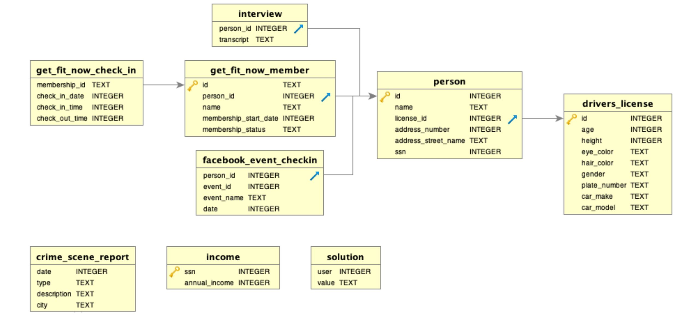

# SQLMurderMystery
Solution to SQL Murder Mystery from http://mystery.knightlab.com/ 


## Part 0: What do we have to work with? 

The first hint we get to solving the murder mystery is that murder took place in on `Jan 15, 2018` in `SQL City`.

Second we get the `schema` for the database  



## Part 1: Getting the murder description

Looking at the dates the first thing I tried was to get the crime scene descriptions of all the `murders` on `Jan 15, 2018`

The following query gave me what I needed

```
SELECT type, description, city
FROM crime_scene_report
WHERE where type='murder' AND date='20180115'
```


## Part 2: Getting witness reports

The previous query led to me street names of the witnesses.

The next logical step was to see what the witnesses saw.

To gather the names of the witnesses and their interviews I ran the following query

```
SELECT name, transcript, address_street_name 
FROM interview i
JOIN person p
ON i.person_id = p.id
WHERE address_street_name='Northwestern Dr' OR address_street_name='Franklin Ave' ORDER BY p.address_street_name ASC

```

## Part 3: Catching the murderer

The witness interviews revealed 2 key pieces of information. A partial for a licence plate and a gold tier gym member ship account number

Relying on a little bit of luck I used the partial license plate and queried for people with a gym member ship who had a matching partial licence plate which led me to the murdered. 


```
SELECT p.name 
FROM person p
JOIN get_fit_now_member gf
ON gf.person_id = p.id
JOIN drivers_license d
ON p.license_id = d.id
WHERE d.plate_number like '%H42W%'
```

## The murderer was `Jeremy Bowers`


